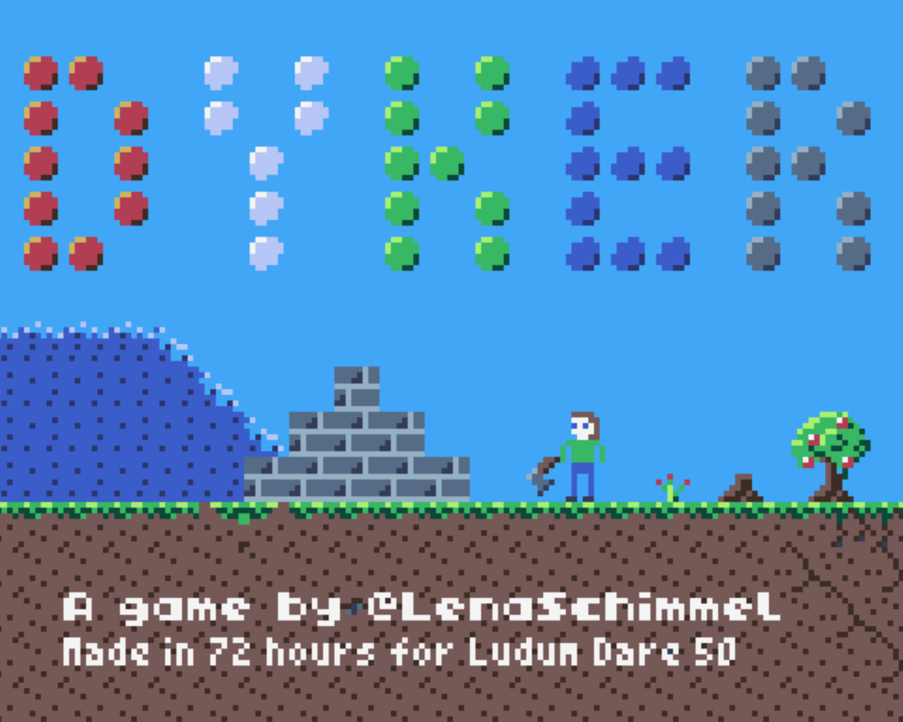

## DYKER

**Balance building a dyke and pushing your economy to earn enough resources before everything is flooded**

A mouse-controlled, small but somewhat complex game of dyke building and economy, with some card game mechanics sprinkled on top. The approaching flood wave might frighten you, but you may keep your calm, because time only passes while you are moving or working.

## Instructions
[Play the game online in your Browser](http://tic80.com/play?cart=2734).

Or download the matching game for your platform from [the Ludum Dare page](https://ldjam.com/events/ludum-dare/50/dyker) or from [Github](https://github.com/lenaschimmel/dyker/tree/main/release). This game was created using [TIC-80](http://tic80.com/), and if you have any trouble running it, general TIC-80 advice applies. This game intentionally has no sound (well, actually I ran out of time to compose music and synth sounds).

The game is entirely controlled with the mouse pointer, using only the primary mouse key. You might need the ESC key to quit the game, and you can use scroll gestures starting in level 2 (level 1 fits on the screen). You _can_ play it on a mobile device with touch control, but I do not recommend it, because you can't hover over buttons.

Take your time to explore the UI. Many elements show a description at the top of the screen.

In each level, you need to earn a specific amount of money before the flood crushes your insland, your economy or even you. If you feel hopeless, you may restart the level with the icon at the top right.

## TIC-80 Cartridge

_The above image contains the actual Game - you can open the Cartidge with TIC-80._

## Game elements
 * **you** - you can't cross the water or climb/jump steps bigger than one block
 * **water** - the flood comes in from the left, and advances exactly one tile per time unit
 * **time** - time stands still while you think and explore the UI - it only passes when you walk, work or use the "wait" action (time passes until a tree or sheep grows apple or wool)
 * **resources**
    * **stone** - needed to build dykes and buying some other objects
    * **wood** - you can buy objects or trade it in for coins using cards
    * **coins** - a certain amount of coins is needed to win each level, but you can also buy other things with it
    * **cards** - play cards to buy objects, trade or get extra effects
    * **time** - the amount of time to walk somewhere, build or collect something is often displayed along the other resource costs
 * **objects** - some objects are already there at the beginning of a level, while others can be built into the landscape by you, mostly by playing cards
    * **dyke** - primarily built to keep the flood out, you can also use dykes as steps to reach higher ground. Dykes must be build like pyramids, you can't build upright walls
    * **rocks** - cut rocks to gain stone resources
    * **trees** - pick apples to gain coins, or cut the tree for wood
    * **sheep** - get a bit of money for its wool, or more money for its meat
    * **mine** - a nearly-endless source of stones, but slower to collect than rocks
    * **well** - build this to speed up the growth of all your trees
    * **chest** - contains a single card
    * **house** - you can study here to get more cards - which takes a lot of time
 * **equipment** - permanent power-ups
    * **axe** - pick or cut rocks and trees faster
    * **boots** - walk faster

## Sister game
This game was created under the roof of Pistacchio Studios, based on the same idea as its sister game [Shepherd's Island](https://ldjam.com/events/ludum-dare/50/shepherds-island) by @flauschzelle and @blinry. We decided that we wanted to explore different executions of that idea and wrote two games which share nothing but the same basic concept and the programming language (lua).

## Update history
In compliance with the _Additional Notes for both the Jam and Compo_ from the [rules](https://ldjam.com/events/ludum-dare/rules) I published some bug fixes after the deadline and outline them below:

 * April 6, 18:50 CET - three small fixes
   * fixed text typo
   * fixed crash when you win the game
   * fixed level restart - initial resources now also reset to the original amount
 * April 8, 12:35 CET - three more fixes
   * fixed wells: building more than one well does no longer stop all apples from growing completely, instead they grow even faster now
   * fixed very glitchy end game screen
   * fixed text typo